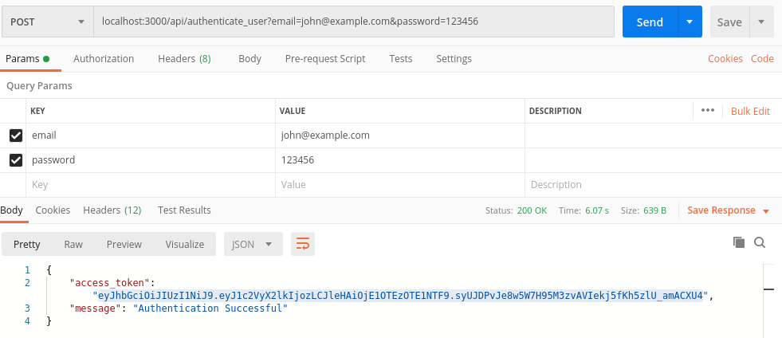
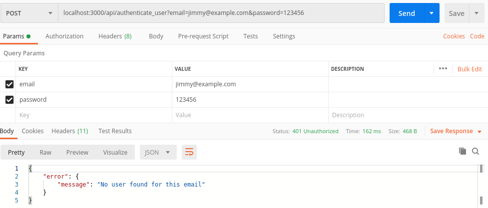
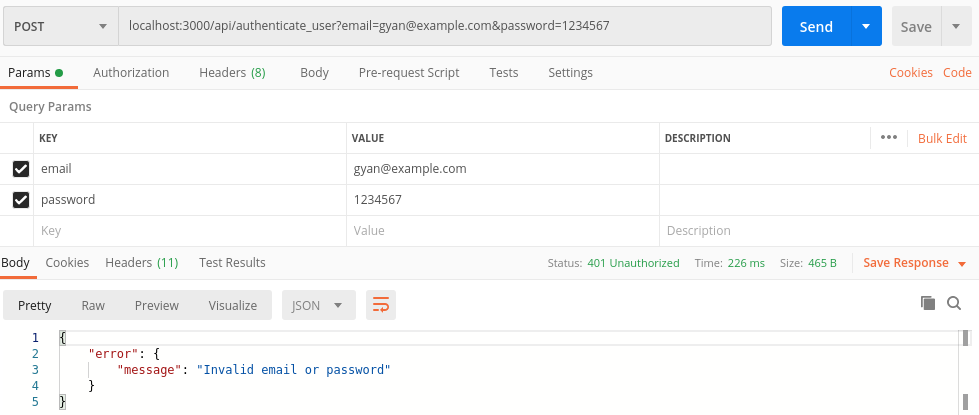
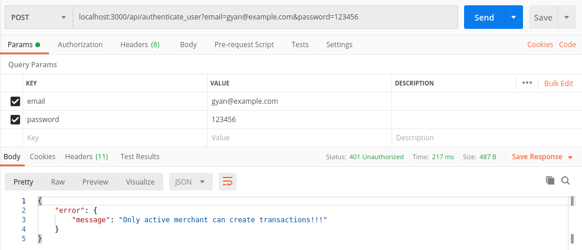
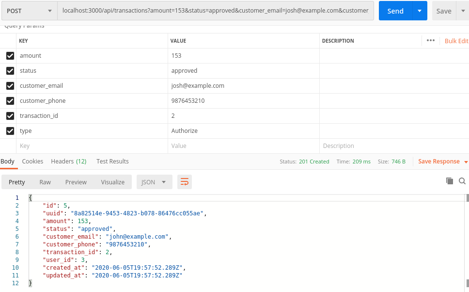
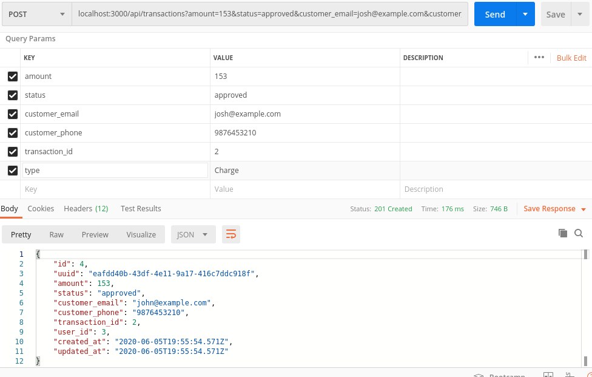
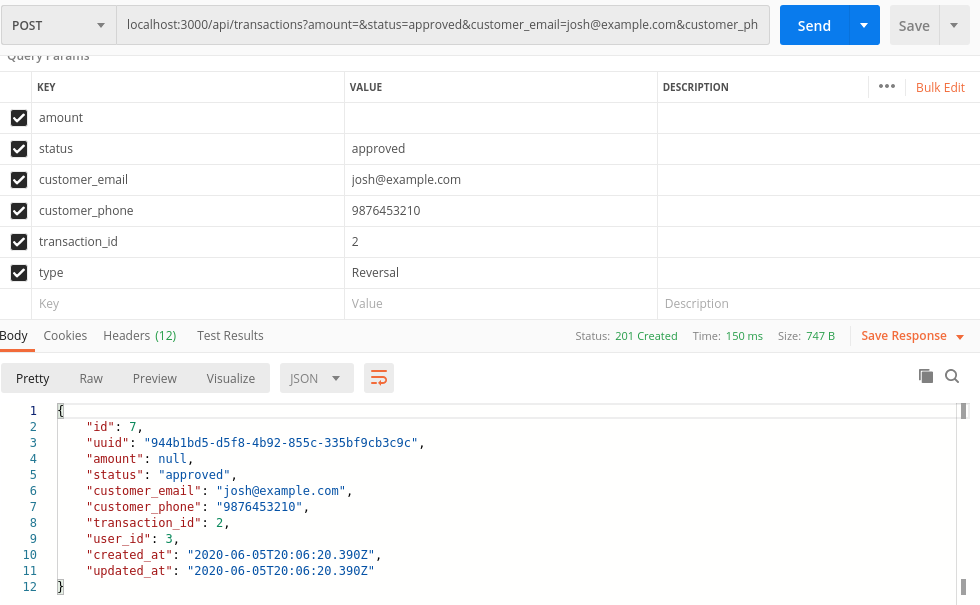
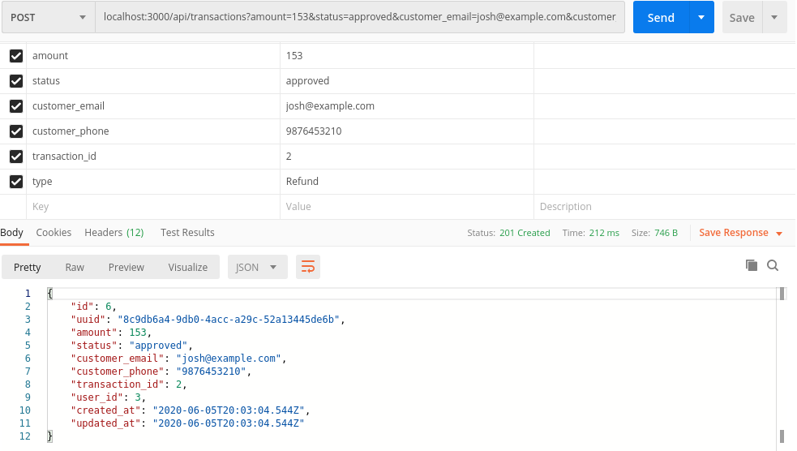

# Payment App

## Some useful docker commands
* `docker-compose up --build`
* `docker-compose exec server bash -c "bundle exec rails db:create"`
* `docker-compose exec server bash -c "bundle exec rails db:migrate"`

Check out the complete list of commands in the [Docker documentation](https://docs.docker.com/engine/reference/commandline/docker/)

## Creating users (admin/merchant)
To create users you can run `docker-compose exec server bash -c "bundle exec rake db:create_users"`.
It uses a CSV file `user_data.csv` you can edit it to create users of you choice.

## Authorizing user and getting token

### Some checks while user authentication
1. If we can not find user with give params

2. If email or password is invalid

3. If user is not an active merchant

## Creating different type of transactions

* **Base Transaction** 

* **Authorized Transaction** 

* **Charged Transaction** 

* **Reversed Transaction** 

* **Refunded Transaction** 

